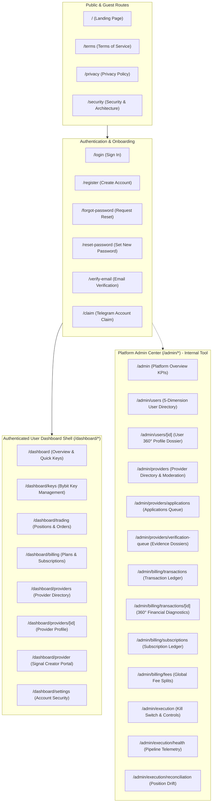

# Tadex Web Application — Master Design Handoff & UI/UX Specification (v2.0)

**Document Version:** 2.0.0  
**Target Designer:** Kemi (Figma Lead Designer)  
**Engineering Context:** Tadex Web Application (`tadex-landing2`)  
**Base Architecture:** Next.js (App Router), TypeScript, Tailwind CSS, Lucide Icons, React Hook Form + Zod, in-memory JWT auth with httpOnly refresh cookies.  
**Date:** August 2026  

---

## Executive Summary & Purpose

This document is the **authoritative, screen-by-screen design handoff and design-system specification** for the Tadex Web Application. It replaces the early conceptual draft (*"Tadex_Web_Implementation_Design_Specification.pdf"* from July 2026), reflecting the full production application as built, tested, and live today.

### What is Tadex?
Tadex is a **non-custodial cryptocurrency signal execution automation platform** tailored for retail traders in Nigeria (NGN), Kenya (KES), and Ghana (GHS). Users connect exchange API keys with **strict trade-only permissions** (e.g. Bybit) and automatically execute signals published by verified Signal Providers. 

**Core Product Principles:**
1. **100% Non-Custodial:** Tadex **never holds user funds, never requests withdrawal permissions, and never stores raw API secrets in plaintext**.
2. **Build-Ahead-of-Design Convention:** The entire application is built using **semantic design tokens** (`bg-primary`, `bg-card`, `text-muted-foreground`, `border-border`, etc.) with neutral placeholder styling. Real colors, typography, elevations, and assets in Figma can be mapped 1:1 into the central theme without rewriting components.
3. **Dual-Surface Priority:**
   - **Primary Focus (User-Facing App):** Public marketing pages, authentication, full trading dashboard, API key management, positions/orders monitoring, multi-currency billing, provider marketplace, provider portal, and account settings.
   - **Internal Tooling (Admin Console):** System health, 5-dimension user management, provider moderation, 5-section verification dossiers, billing reconciliation, and emergency circuit breakers.

---

## Part 1: Step 1 Audit & Comparison Against Legacy Spec PDF

Before proceeding with the current specification, we audited the legacy document:  
`Tadex_Web_Implementation_Design_Specification.pdf` (14 pages, July 2026).

### Audit Breakdown:

| Category | Legacy Spec Description | Current Reality in Codebase | Verdict & Impact |
| :--- | :--- | :--- | :--- |
| **Route Architecture** | Listed 12 theoretical routes (`/dashboard`, `/exchanges`, `/providers`, `/risk-settings`, `/positions`, `/provider-center`, etc.) | Consolidated into structured App Router: `/dashboard`, `/dashboard/keys`, `/dashboard/trading`, `/dashboard/billing`, `/dashboard/providers`, `/dashboard/providers/[id]`, `/dashboard/provider`, `/dashboard/settings`. Removed standalone `/risk-settings` and `/positions` (now unified into `/dashboard/trading`). | **Significantly Changed:** Consolidated for streamlined UX. |
| **Auth Flows** | Only mentioned basic `/login` and `/register`. | Full multi-screen auth system built: `/login`, `/register`, `/forgot-password`, `/reset-password`, `/verify-email`, and `/claim` (Telegram account linking). | **Missing in Old Spec:** 4 out of 6 auth screens were completely absent. |
| **Public / Legal Pages** | Mentioned landing page and pricing tiers vaguely. | Fully articulated `/` (with 10 interactive sections), `/terms`, `/privacy` (NDPR + API key retention disclosures), `/security` (AES-256 + trade-only architecture). | **Missing in Old Spec:** Complete legal/compliance architecture was unwritten. |
| **Exchange Key Setup** | Screen 3.2 envisioned radio exchange selector and simulated API validation. | Built in `/dashboard/keys` (`ApiKeyManager.tsx`) with strict trade-only Bybit enforcement, real-time backend API permission check, withdrawal-permission rejection banner, testnet toggle, masked key rendering (`key_****1234`), and permanent deletion on revocation. | **Updated & Hardened:** Real operational security rules applied. |
| **Trading Center** | Screen 3.1 & 3.4 envisioned split positions and risk settings. | Built in `/dashboard/trading` (`PositionsTable.tsx` & `OrdersTable.tsx`) with real-time open positions, PnL formatting (`+$` green / `-$` red), leverage chips, TP/SL indicators, status filtering tabs, and emergency close triggers. | **Consolidated:** Unified into responsive desktop table + mobile card view. |
| **Provider Portal** | Screen 4.1 envisioned an "AI Signal Builder & Parser" only. | Built a 4-state lifecycle portal in `/dashboard/provider`: (1) Unregistered 404 landing hero, (2) Applicant pending review card, (3) Applicant rejected card with re-apply, (4) Active Provider Dashboard with live metrics, 3-plan manager modal (`ProviderPlanManager.tsx`), and a 5-section verification evidence dossier modal (`ProviderVerificationForm.tsx`). | **Vastly Expanded:** The old spec had only a signal parser; the real portal has complete lifecycle governance. |
| **Billing & Checkout** | Screen 3.3 envisioned a checkout drawer with generic pricing. | Built `/dashboard/billing` with live `SubscriptionCard` (lifecycle states, auto-activation polling), multi-currency `PricingGrid` (NGN, KES, GHS, USDT, USD subunit handling), and mobile-optimized `CheckoutQuoteModal` with duration discount quotes (1, 3, 6, 12 months) and Flutterwave/Paystack gateway routing. | **Completely Re-engineered:** Dynamic quote calculation and payment return state handling. |
| **Admin Portal** | Screens 5.1–5.4 outlined basic overview, user list, provider approvals, and crypto reviews. | Complete 6-phase administrative suite built across 10 distinct routes: Admin Role Guard, Platform Overview KPIs, 5-Dimension User Search & 360° Profile Dossiers, Provider Moderation & 5-Section Verification Dossiers, Transaction Ledger & 360° Diagnostics, Subscription Governance, Global Platform Fee Configuration, and High-Gravity System Controls with 2-Step "HALT TRADING" Emergency Kill Switch and live Bybit connectivity pinging. | **Massively Expanded (Phase Admin-1 to 4b):** Over 75% of admin functionality was never in the old spec. |
| **Mobile Responsiveness** | No mobile layouts or responsive behaviors documented. | Full responsive suite implemented: collapsible mobile drawers, responsive hamburger headers, mobile card-view fallbacks for tables, modal viewport scroll containers (`max-h-[90vh]`), and touch-friendly targets. | **Missing in Old Spec:** Zero responsive guidelines existed. |

### Decision:
Because the legacy PDF describes outdated route paths, lacks 4 auth flows, omits the entire 4-stage provider portal lifecycle, omits the comprehensive billing quote engine, and misses 6 phases of admin system controls and mobile responsive behaviors, **this new document (`Tadex_Web_Design_Handoff_v2.md`) serves as the active master specification**. The old PDF is retained solely as an archive.

---

## Part 2: Master Information Architecture & Route Inventory



---

## Part 3: Screen-by-Screen Inventory & UI Specification

---

### Section 3.1: Public & Marketing Pages

#### 1. Landing Page (`/`)
* **Purpose:** Public storefront educating retail traders on non-custodial crypto automation and capturing waitlist/registration interest.
* **Target Audience:** Prospective retail crypto traders in Nigeria, Kenya, and Ghana.
* **Distinct UI Elements & Sections:**
  1. *Hero Section (`Hero.tsx`):* Headline, sub-headline, primary CTA ("Start Automated Trading"), secondary CTA ("Connect Telegram Bot"), floating live performance stat badge, non-custodial trust pill.
  2. *Feature Grid (`Features.tsx`):* 3-column cards detailing Non-Custodial Security, Millisecond Signal Execution, Multi-Currency Local Settlement (NGN/KES/GHS/USDT).
  3. *How It Works (`HowItWorks.tsx`):* 3-step timeline (1. Connect Bybit API, 2. Choose Verified Signal Provider, 3. Trades Auto-Execute).
  4. *Why Automated (`WhyAutomated.tsx`):* Problem/solution comparison (Manual trading emotion/delays vs Automated millisecond execution).
  5. *Feature Comparison Table (`ComparisonTable.tsx`):* Matrix comparing Tadex vs Custodial Bots vs Manual Telegram Copy-Trading.
  6. *Pricing Showcase (`Pricing.tsx`):* Tier cards showing platform access tiers + provider plan pricing previews with currency switcher.
  7. *Product Roadmap (`Roadmap.tsx`):* Interactive phased milestones (Phase 1 Bybit Spot/Futures, Phase 2 Multi-Exchange, Phase 3 Social Copy).
  8. *Security & Transparency Card (`SecurityTransparency.tsx`):* Trade-only API architecture, AES-256 encryption, zero withdrawal permission guarantee.
  9. *FAQ Accordion (`FAQ.tsx`):* Expandable answers to common security, billing, and exchange questions.
  10. *Final CTA Banner (`FinalCTA.tsx`):* High-contrast banner with quick registration trigger.
  11. *Footer (`Footer.tsx`):* Product links, legal links (`/terms`, `/privacy`, `/security`), country currency indicators, copyright.
  12. *Interactive Modals:* `WaitlistModal.tsx` and `PlanWaitlistModal.tsx` for capturing early user emails.
* **Data Sources:** Static marketing copy + dynamic pricing tier previews from Supabase.
* **Key Actions:** Open registration modal, switch currency preview, toggle FAQ accordions, navigate to `/register`, `/login`, or `/security`.
* **Current Styling State:** Semantic design tokens with dark/light mode support.
* **Responsive Behavior:** Full mobile stack; hamburger menu on mobile; tables collapse into swipeable cards; modal sheets slide up from bottom on mobile.

#### 2. Terms of Service (`/terms`)
* **Purpose:** Legally binding operational terms defining Tadex as a non-custodial software marketplace (not an investment adviser).
* **Distinct UI Elements:** Legal header with effective date and "Operational Draft Pending Formal Legal Review" alert banner; 8 structured policy sections; itemized billing/cancellation policy; liability disclaimers.
* **Current Styling State:** Typography-focused layout using semantic `text-foreground`, `text-muted-foreground`, and `border-border`.

#### 3. Privacy Policy (`/privacy`)
* **Purpose:** Full statutory and NDPR-compliant privacy disclosure detailing exchange API key encryption, data retention, and instant key deletion.
* **Distinct UI Elements:** Data Collection Matrix (encrypted API keys, email, Telegram IDs, billing metadata); Data Retention & Immediate Deletion Guarantee (keys permanently purged upon user revocation); Cookie Policy (`httpOnly` session tokens); Contact DPO email.
* **Current Styling State:** Structured semantic documentation cards.

#### 4. Security & Transparency (`/security`)
* **Purpose:** Technical deep-dive for security-conscious traders explaining how Tadex protects API keys and enforces zero-custody.
* **Distinct UI Elements:** 4 Security Architecture Cards: 1. AES-256 Envelope Encryption at Rest, 2. Trade-Only API Enforcement (Withdrawals Blocked), 3. IP Whitelist Guidance, 4. In-Memory Session Tokens.

---

### Section 3.2: Authentication & Onboarding Flows

#### 1. User Login (`/login`)
* **Purpose:** Secure authentication for returning retail traders and admins.
* **Distinct UI Elements:** Centered card layout; Brand logo; Email input; Password input with show/hide toggle; "Remember Me" checkbox; "Forgot Password?" link; "Sign In" primary button with loading spinner; Direct link to `/register`.
* **Data & State:** Zod-validated `loginSchema`; submits to `POST /api/v1/auth/login`; stores JWT in-memory and sets `httpOnly` refresh cookie; redirects to `/dashboard` or `/admin` based on user role.
* **Responsive Behavior:** Full viewport centered on desktop; edge-to-edge padded card on mobile.

#### 2. User Registration (`/register`)
* **Purpose:** New trader account creation.
* **Distinct UI Elements:** Email input; Password input (enforces min 8 characters); Confirm Password input; Terms & Privacy agreement notice with active links; "Create Account" primary button; Link to `/login`.
* **Data & State:** Zod-validated `registerSchema`; submits to `POST /api/v1/auth/register`; triggers email verification flow.

#### 3. Forgot Password (`/forgot-password`)
* **Purpose:** Self-service password recovery initiation.
* **Distinct UI Elements:** Instructional card; Email input; "Send Reset Link" button; Success state card with instructions to check email; Back to Login link.
* **Data & State:** Submits to `POST /api/v1/auth/forgot-password`.

#### 4. Reset Password (`/reset-password`)
* **Purpose:** Complete password reset via single-use email token.
* **Distinct UI Elements:** Reads `?token=` parameter; New Password input; Confirm New Password input; Password strength indicator; "Update Password" button; Auto-redirect countdown to `/login` upon success.
* **Data & State:** Zod-validated `resetPasswordSchema`; submits to `POST /api/v1/auth/reset-password`.

#### 5. Email Verification (`/verify-email`)
* **Purpose:** Verify user email address from email link.
* **Distinct UI Elements:** Reads `?token=`; Loading spinner during handshake; Verified success card with green badge; Error state card with "Resend Verification" trigger; "Continue to Dashboard" button.
* **Data & State:** Validates `email_verified === true` against `POST /api/v1/auth/verify-email`.

#### 6. Telegram Account Claim Flow (`/claim`)
* **Purpose:** Bridges users onboarded via the Tadex Telegram Bot to the web dashboard.
* **Distinct UI Elements:** Reads single-use 15-minute token (`?token=`) generated by `/link_web` in Telegram; Web Email input; New Password input; Confirm Password input; "Complete Account Claim" CTA; "Invalid / Expired Token" fallback screen directing user back to Telegram bot.
* **Data & State:** Submits to `POST /api/v1/auth/claim-account`; immediately logs in user and routes to `/dashboard`.

---

### Section 3.3: Main Dashboard Shell & Navigation

#### Global Dashboard Shell (`DashboardHeader.tsx`)
* **Structure:** Sticky 64px top bar anchored across the viewport (`bg-card/90 backdrop-blur-md`).
* **Desktop Elements:**
  1. *Brand Logo:* "T" badge + "Tadex App" text (routes to `/dashboard`).
  2. *Navigation Links:*
     - **Overview** (`/dashboard`)
     - **API Keys** (`/dashboard/keys`)
     - **Trading** (`/dashboard/trading`)
     - **Browse Providers** (`/dashboard/providers`)
     - **Provider Portal** (`/dashboard/provider`)
     - **All Plans** (`/dashboard/billing`)
     - **Settings** (`/dashboard/settings`)
  3. *User Identifier Pill:* Displays `User: <email_prefix>` and Status pill (`active`).
  4. *Log Out Button:* Initiates `POST /api/v1/auth/logout`, wipes in-memory auth store, routes to `/login`.
* **Mobile Behavior (< 768px):**
  - Desktop nav links hide behind a hamburger menu button.
  - Tapping hamburger slides down a full-width mobile navigation drawer.
  - Mobile drawer contains user email chip, all 7 navigation destinations, and a full-width destructive "Log Out" button.

---

### Section 3.4: Authenticated Trader Dashboard Routes

#### 1. Dashboard Overview (`/dashboard`)
* **Purpose:** High-level operational command center for the retail trader.
* **Distinct UI Elements:**
  1. *Welcome Header:* Title and subtext confirming non-custodial status.
  2. *3 Metric Stat Cards:*
     - **Signal Execution Status:** "Active" badge with pulsing green status indicator.
     - **Connected Exchange API Keys:** Displays count (e.g. "1 Connected" vs "Not Connected") and "Read/Trade Only" security badge.
     - **Account Security:** "Verified" badge + "HttpOnly Cookie" token indicator.
  3. *Embedded Key Manager:* Direct access to connect or view Bybit keys.
  4. *Recent Signal Executions Feed:* Activity feed showing recent automated trade dispatches or empty state.
* **Data Sources:** `GET /me`, `GET /keys`, `GET /trading/orders`.
* **Responsive Behavior:** 3 metric cards stack to 1 column on mobile, 2 on tablet, 3 on desktop.

#### 2. Exchange API Key Management (`/dashboard/keys`)
* **Purpose:** Securely link Bybit API credentials to enable trade execution.
* **Distinct UI Elements (`ApiKeyManager.tsx`):**
  1. *Mandatory Security Instruction Banner:* Prominent alert box with direct link to Bybit Mainnet/Testnet API settings. Highlights 3 rules: System-Generated API key, Read-Write trade permissions, **Withdrawal MUST BE DISABLED**.
  2. *Connected Keys Card (Left Column):*
     - List of connected keys with Exchange name (Bybit), Environment badge (Mainnet in primary / Testnet in secondary), Status pill (`active` with pulse dot), Masked API Key (`key_****1234`), Connected Date.
     - Refresh button.
     - "Disconnect" button triggering an **inline red confirmation banner** ("Revoking this key will pause automated trading execution. Are you sure?").
  3. *Connect Key Form (Right Column):*
     - Exchange selector (Bybit default).
     - Environment switch: "Live Mainnet" vs "Testnet / Demo".
     - API Key input field (masked).
     - API Secret input field (password masked with eye reveal toggle).
     - "Connect & Validate Key" primary action button with loading spinner.
     - *Security Error Alert:* Specialized red warning box triggered if Bybit detects withdrawal permissions: *"Security Violation: Withdrawal permission detected. Tadex requires trade-only keys."*
* **Data Sources:** `GET /keys`, `POST /keys`, `DELETE /keys/{id}`.
* **Key Actions:** Real-time permission handshake with Bybit; immediate revocation and permanent database deletion.
* **Responsive Behavior:** 2-column desktop grid collapses into stacked single column on mobile.

#### 3. Trading Center: Positions & Orders (`/dashboard/trading`)
* **Purpose:** Live monitoring of open crypto positions and past signal execution orders.
* **Distinct UI Elements:**
  1. *Active Positions Card (`PositionsTable.tsx`):*
     - Header with live refresh button.
     - **Desktop Table View:** Columns for Symbol (e.g. `BTCUSDT`), Side badge (`LONG` in emerald / `SHORT` in crimson), Sizing, Entry Price, Mark/Current Price, Leverage chip (e.g. `10x`), TP/SL targets, Unrealized PnL (`+$45.20` in green / `-$12.10` in red), Emergency Close action button.
     - **Mobile Card View (< 640px):** Replaces wide table with stacked key-value cards showing Symbol, Side badge, Entry vs Mark price, PnL chip, and full-width Emergency Close button.
     - *Empty State:* "No active positions. Automated signal triggers will open and monitor trades here."
  2. *Execution Order History Card (`OrdersTable.tsx`):*
     - Status Filter Tabs / Mobile Select Dropdown: `All`, `Filled`, `Pending`, `Cancelled`, `Failed`.
     - Header with refresh button.
     - **Desktop Table View:** Order ID (mono), Timestamp, Symbol, Side, Type (`Market`/`Limit`), Size, Fill Price, TP/SL, Status badge (`Filled` emerald, `Pending` amber, `Cancelled` neutral, `Failed` destructive).
     - **Mobile Card View (< 640px):** Compact card view per order with status chip and formatted time.
* **Data Sources:** `GET /trading/positions`, `GET /trading/orders?status=...`.
* **Responsive Behavior:** Seamless desktop-table to mobile-card transformation.

#### 4. Billing & Subscriptions (`/dashboard/billing`)
* **Purpose:** Manage active subscriptions, browse pricing catalog, and execute multi-currency checkout.
* **Distinct UI Elements:**
  1. *Payment Return State Alert:* Detects `?status=success` or transaction reference on return from gateway; displays an automated verification polling card (polls up to 8 times / 16s) and auto-activates subscription.
  2. *Active Subscription Card (`SubscriptionCard.tsx`):*
     - Active status shield (Emerald checkmark if active, Amber alert if inactive/expired).
     - Plan Name, Provider Name, Tier badge, Status pill (`active`, `trialing`, `past_due`, `paused`, `canceled`).
     - Billing cycle dates (Current Period Start, Expiration / Next Billing Date).
     - *Suspended Provider Alert:* Honest warning banner if provider is suspended: *"Signal Execution Paused: Provider operations temporarily suspended."*
     - Notifications list.
  3. *Pricing Plans Catalog (`PricingGrid.tsx`):*
     - Global Currency Selector: Switch catalog between `NGN`, `KES`, `GHS`, `USDT`, `USD`.
     - 3-Column Plan Cards Grid: Plan Name, Provider Brand Name, Monthly Price formatted in selected currency with subunit accuracy (e.g. `₦15,000.00/mo` or `$25.00/mo`), Unsupported Currency fallback pill (`Only available in NGN`), Feature checklist, "Subscribe Now" CTA button.
  4. *Multi-Currency Checkout Modal (`CheckoutQuoteModal.tsx`):*
     - Scrollable modal card (`max-h-[90vh] overflow-y-auto`) ensuring all CTA buttons remain visible on short mobile screens.
     - Plan summary and provider brand name.
     - Duration Selector Buttons: `1 Month`, `3 Months (5% off)`, `6 Months (10% off)`, `12 Months (20% off)`.
     - Currency Selector: Toggle settlement currency (`NGN`, `KES`, `GHS`, `USDT`, `USD`).
     - Dynamic Price Breakdown Quote: Provider Monthly Fee + Tadex Platform Fee (₦1,500 / $10.00) = Total Amount.
     - *Email Verification Gate:* Warning alert blocking unverified users with a direct CTA to verify email before paying.
     - "Proceed to Payment" primary button: Redirects to Flutterwave, Paystack, or crypto gateway.
* **Data Sources:** `GET /billing/subscription`, `GET /billing/plans`, `POST /billing/checkout-quote`, `POST /billing/checkout`.
* **Responsive Behavior:** Modal handles viewport heights down to 667px without cutting off buttons; pricing cards stack 1-col on mobile.

#### 5. Provider Directory & Provider Detail (Subscriber-Facing)
* **Route 1: `/dashboard/providers` (`ProviderDirectory.tsx`):**
  - Header with search input and refresh button.
  - 3-Column Grid of Verified Signal Providers.
  - Provider Card: Provider avatar initial, Brand Name, "Verified Provider ✅" badge, Win Rate % tag, 30-Day Total Signals count, Active Subscribers count, Last active date, "View Profile & Plans →" button.
* **Route 2: `/dashboard/providers/[id]` (`ProviderDetailView.tsx`):**
  - "← Back to All Providers" navigation link.
  - Provider Hero Profile Card: Large avatar, Brand name, Verified Tier badge (`basic`, `intermediate`, `advanced`, `premium`, `verified`), Bio/trading methodology, Contact email, Member since date.
  - Performance Metrics Grid: Win Rate %, Signals Sent, Subscribers, Verification Tier.
  - Scoped Plan Grid: Displays only the plans offered by this specific provider.
  - Clicking "Subscribe" opens `CheckoutQuoteModal` pre-scoped to that plan.
* **Data Sources:** `GET /providers`, `GET /providers/{id}`, `GET /providers/{id}/plans`.

#### 6. Provider Self-Service Portal (`/dashboard/provider`)
* **Purpose:** End-to-end portal allowing traders to apply, get verified, manage subscription plans, and monitor their signal subscriber base.
* **4-Stage Lifecycle Architecture (`ProviderPortalRouter`):**
  1. *State 1: Unregistered (404 state)*
     - "Become a Tadex Signal Provider" value proposition hero banner.
     - 3 Feature Highlight Cards: 100% Non-Custodial, Multi-Currency Billing (NGN/USDT), Verified Trader Badge.
     - "Apply to Become a Signal Provider" CTA button opening `ProviderApplyForm.tsx`.
     - *Application Form (`ProviderApplyForm.tsx`):* Brand Display Name, Contact Email, Experience Level dropdown, Trading Focus multi-select chips (Scalping, Day Trading, Swing, Futures, Spot), Bio/strategy textarea, Referral source, Mandatory Terms Checkbox, 409 duplicate conflict handling.
  2. *State 2: Applicant Pending Review*
     - Status Card: "Provider Application Under Review" with amber clock icon.
     - Metadata table: Application ID, Brand Name, Contact Email, Experience Level, Submitted Date, "Pending Review" status pill.
     - Informative callout: 24–48h turnaround time expectation.
  3. *State 3: Applicant Rejected / Needs Update*
     - Status Card: "Application Status: Not Approved" with red X icon.
     - Explicit Rejection Reason alert box with compliance feedback.
     - "Update & Re-apply" CTA button opening pre-filled application form.
  4. *State 4: Active Provider Dashboard (`ProviderDashboard.tsx`)*
     - *Suspended Warning Banner:* Displayed if provider status is `suspended` (disables mutations).
     - *Provider Header Card:* Brand avatar, Verification tier badge, Status pill, Bio, Contact email, Member since date.
     - *4 KPI Metrics Grid:* Active Subscribers count, Total Signals Sent, Win Rate %, Verification Level.
     - *Verification Status Card (`ProviderVerificationCard.tsx`):* Displays current verification badge; "Submit Verification Request" CTA button opening 5-section evidence dossier.
     - *Verification Request Modal (`ProviderVerificationForm.tsx` - 5 Structured Sections):*
       - Section 1: Operator Identity (Legal name, Telegram username, channel link, email, region).
       - Section 2: Signal Operation (Subscriber count, experience duration, execution mode, frequency).
       - Section 3: Trading Evidence (Exchange UID, leaderboard links, statement URLs).
       - Section 4: Historical Signals Table (Dynamic add/remove rows, enforcing min 3 / max 10 past signals with Symbol, Entry, SL, TP, Date, Outcome, Message Link).
       - Section 5: Affirmations & Declarations (5 mandatory checkboxes with full disclosure text).
     - *Plan Management Module (`ProviderPlanManager.tsx` & `ProviderPlanModal.tsx`):*
       - List of owned plans with status pills (`active`, `paused`, `draft`, `archived`).
       - **3-Active-Plan Cap Enforcement:** Proactively disables "Create Plan" button with tooltip when 3 active plans exist.
       - Plan Creation/Edit Modal: Plan Name, Currency (NGN/USDT), Monthly Price, Description, Features list, Max duration.
       - Plan Deactivation confirmation dialog.
* **Data Sources:** `GET /provider/me`, `POST /provider/apply`, `GET /provider/plans`, `POST /provider/plans`, `DELETE /provider/plans/{id}`, `POST /provider/request-verification`.

#### 7. Account Settings (`/dashboard/settings`)
* **Purpose:** User account security, password updates, and global session revocation.
* **Distinct UI Elements (`AccountSettings.tsx`):**
  1. *Account Overview Card:* Masked user UUID, Email address, Account status.
  2. *Change Password Card:*
     - Current Password input.
     - New Password input (min 8 characters).
     - Confirm New Password input.
     - "Update Password" button with loading spinner.
     - Success banner: *"Your password has been changed successfully. You've been logged out of all other devices."*
  3. *Log Out Everywhere Security Action Card:*
     - Security explanation (revokes all active refresh tokens and terminates sessions on other devices).
     - "Log Out of All Devices" destructive button.
     - Inline confirmation alert dialog with "Confirm Revoke All" action.
* **Data Sources:** `POST /api/v1/auth/change-password`, `POST /api/v1/auth/logout-all`.

---

### Section 3.5: Platform Administration Console (`/admin/*`)
> [!IMPORTANT]
> **Designer Note for Kemi:** The `/admin` routes represent an **internal operations and risk-governance tool** used by the Tadex internal team, not retail traders. It is lower priority than the user-facing application and should use a clean, data-dense, functional administrative aesthetic.

#### Global Admin Shell (`AdminHeader.tsx`, `AdminRoute.tsx`)
* **Admin Role Guard:** Restricts access to users where `role === 'admin'`. Redirects normal users to `/dashboard` and unauthenticated sessions to `/login`.
* **Admin Navigation Tabs:**
  - `Overview` (`/admin`)
  - `Users` (`/admin/users`)
  - `Billing & Revenue` (`/admin/billing/transactions`)
  - `System Controls` (`/admin/execution`)
  - `Providers` (`/admin/providers`)
  - `Applications` (`/admin/providers/applications`)
  - `Verification Queue` (`/admin/providers/verification-queue`)
  - *Stub:* `Audit Logs` (labeled "Coming Soon").
* **Top Right Actions:** "Exit to Trading App" deep link, admin email badge, Log out button. Full mobile drawer navigation included.

#### 1. Admin Platform Overview (`/admin`)
* **Purpose:** Real-time platform KPI telemetry and operational needs-attention queues.
* **Distinct UI Elements (`AdminOverview.tsx`):**
  1. *Global Kill Switch Alert Banner:* Visible if global execution stop is active.
  2. *6 KPI Metric Cards:* Registered Users (Active/Suspended/Banned), Signal Providers (Active/Verified/Suspended), Connected Exchange Accounts (Active/Revoked), Active Subscriptions (Total/Trialing/Cancelled), 24h Payment Volume & Tx Count, Execution Engine Health (24h trade dispatch volume, success rate %, task queue depth).
  3. *"Needs Attention" Action Cards:* Direct shortcuts to Pending Applications, Verification Queue dossiers, and Suspended Providers.
* **Data Sources:** `GET /admin/overview`.

#### 2. User Management Console (`/admin/users` & `/admin/users/[id]`)
* **Route 1: User Directory (`/admin/users` - `AdminUserTable.tsx`):**
  - **5-Dimension Search Box (`q`):** Debounced backend search across Email, Telegram Username, Telegram User ID, User UUID, and Exchange UID.
  - **Filter Toolbars:** Status (`All`, `Active`, `Suspended`, `Banned`, `Deleted`), Email Verification (`All`, `Verified`, `Unverified`), Role (`All`, `User`, `Admin`), Auth Origin (`All`, `Web`, `Telegram`, `Bot`).
  - Desktop table / Mobile card view with server-side pagination.
  - Action link: "View 360° Profile →".
* **Route 2: User 360° Profile Dossier (`/admin/users/[id]` - `AdminUserDetailView.tsx`):**
  - *Header Toolbar:* User avatar, Email, UUID, Status badge, Role badge, Beta Tester chip, and contextual action buttons.
  - *Module 1: Identity & Authentication:* Email, verification state, Telegram handle (@username), Telegram User ID, phone number, terms acceptance date, last seen timestamp.
  - *Module 2: Connected Exchange Accounts:* Table of connected exchanges with account name, trading mode, leverage, and **strictly masked keys only** (`api_key_masked`). Zero private keys/secrets rendered.
  - *Module 3: Signal Subscriptions:* Plan name, provider name, tier, active dates, status.
  - *Module 4: Signal Provider Profile (if provider):* Brand name, verification tier badge, subscribers, signals sent.
  - *Module 5: Billing & Transactions History:* Transaction ID, amounts, gateway, status.
  - *Module 6: Administrative Audit Timeline:* Historical audit logs of administrative actions on this account.
  - *Administrative Action Modals:*
    - **Ban User Modal (`AdminBanUserModal.tsx`):** Destructive modal requiring mandatory justification reason ($\ge 3$ characters).
    - **Unban User Modal (`AdminUnbanUserModal.tsx`):** Confirmation dialog.
    - **Admin Force Logout-All Modal (`AdminForceLogoutModal.tsx`):** Revocation dialog with mandatory reason.
    - **Force Verify Email Modal (`AdminForceVerifyModal.tsx`):** Compliance override with mandatory reason.
    - **Resend Verification Email Button:** One-click trigger.
* **Data Sources:** `GET /admin/users`, `GET /admin/users/{id}`, `POST /admin/users/{id}/ban`, `POST /admin/users/{id}/unban`, `POST /admin/users/{id}/logout-all`, `POST /admin/users/{id}/force-verify-email`.

#### 3. Provider Moderation & Governance (`/admin/providers/*`)
* **Route 1: Provider Directory (`/admin/providers` - `AdminProviderTable.tsx`):**
  - Search bar and status tabs (`All`, `Active`, `Suspended`, `Verified`, `Deleted`).
  - Columns: Provider Name, Owner Email, Status badge, Verification Tier badge, Subscriber count, Signals sent, Win Rate %, View Details modal trigger.
  - **Suspend Provider Modal (`AdminSuspendModal.tsx`):** Mandatory reason ($\ge 3$ chars) before suspending.
  - **Unsuspend Action:** Confirm dialog restoring provider status.
* **Route 2: Applications Queue (`/admin/providers/applications` - `AdminApplicationsQueue.tsx`):**
  - Incoming applicant registration cards with trading focus chips, experience, bio, referral source.
  - Status tabs: `Pending Review`, `Approved`, `Rejected`, `All`.
  - **Approve Modal:** Allows overriding display name and adding internal approval notes.
  - **Reject Modal:** Enforces mandatory rejection reason visible to the applicant for re-application.
* **Route 3: Verification Evidence Queue (`/admin/providers/verification-queue` - `AdminVerificationQueue.tsx`):**
  - Interactive evidence review queue with collapsible panels for the 5 submitted sections (Operator Identity, Signal Operation, Trading Evidence/Links, Historical Signals Table, Affirmations).
  - **Verify Modal:** Tier selection (`basic`, `intermediate`, `advanced`, `premium`, `verified`), reviewer notes, and risk flags.
  - **Reject Verification Modal:** Mandatory justification reason.
* **Data Sources:** `GET /admin/providers`, `POST /admin/providers/{id}/suspend`, `POST /admin/providers/{id}/unsuspend`, `GET /admin/providers/applications`, `POST /admin/providers/applications/{id}/approve`, `POST /admin/providers/applications/{id}/reject`, `POST /admin/providers/{id}/verify`, `POST /admin/providers/{id}/reject-verification`.

#### 4. Billing & Revenue Governance (`/admin/billing/*`)
* **Sub-Navigation (`AdminBillingNav.tsx`):** Tabs for `Transaction Ledger`, `Subscription Ledger`, `Platform Fees & Splits`.
* **Route 1: Transaction Ledger (`/admin/billing/transactions` - `AdminTransactionsTable.tsx`):**
  - Search query (`q`), Status filter (`Success`, `Pending`, `Failed`), Gateway filter (`Flutterwave`, `Paystack`, `Crypto`), Currency filter (`NGN`, `USDT`, `USD`).
  - Desktop table & Mobile card view showing Gross Paid, Platform Retained Fee chip, Provider Net Payout, and "Diagnostics →" link.
* **Route 2: Transaction 360° Diagnostics (`/admin/billing/transactions/[id]` - `AdminTransactionDetailView.tsx`):**
  - 360° Financial Breakdown: Gross, Platform Fee, Provider Payout, Failure callout with `error_message`.
  - Linked Context Cards: Customer Account link, Provider link, Subscription link.
  - Raw Webhook Payload Viewer: Collapsible syntax-highlighted JSON viewer with "Copy JSON".
  - **Manual Reconcile Modal (`AdminReconcileModal.tsx`):** Manual payment verification override with mandatory audit reason ($\ge 3$ chars).
* **Route 3: Subscription Ledger (`/admin/billing/subscriptions` - `AdminSubscriptionLedgerTable.tsx`):**
  - Filter across all platform users by status and tier.
  - **Cancel Subscription Modal (`AdminCancelSubscriptionModal.tsx`):** Immediate vs Period-End cancellation mode with mandatory audit reason.
  - **Set Status Modal (`AdminSetSubscriptionStatusModal.tsx`):** Status override dropdown (`trialing`, `active`, `past_due`, `paused`, `canceled`, `expired`) with mandatory audit reason.
* **Route 4: Platform Fee Configuration (`/admin/billing/fees` - `AdminPlatformFeesView.tsx`):**
  - Active Global Fee Cards: **NGN (₦1,500)** and **USDT ($10.00)**.
  - Revenue split formula explanation card.
  - Historical Fee Revision Table: Audit trail of past fee changes.
  - **Update Global Fee Modal (`AdminUpdateFeeModal.tsx`):** High-consequence dialog with red/amber danger ring, critical consequence warning, and double-confirmation acknowledgment checkmark.
* **Data Sources:** `GET /admin/billing/transactions`, `GET /admin/billing/transactions/{id}`, `POST /admin/billing/transactions/{id}/reconcile`, `GET /admin/billing/subscriptions`, `POST /admin/billing/subscriptions/{id}/cancel`, `POST /admin/billing/subscriptions/{id}/set-status`, `GET /admin/billing/fees`, `POST /admin/billing/fees`.

#### 5. System Controls & Execution Engine (`/admin/execution/*`)
* **Sub-Navigation (`AdminExecutionNav.tsx`):** Tabs for `System Controls & Kill Switch`, `Pipeline Health & Telemetry`, `Position Reconciliation`.
* **Route 1: System Controls & Master Kill Switch (`/admin/execution`):**
  1. *High-Gravity Global Kill Switch Card (`AdminKillSwitchCard.tsx`):*
     - Permanent visual centerpiece with heavy-duty borders and pulsing status indicators (`ACTIVE / NORMAL` vs `EMERGENCY STOP ACTIVE`).
     - **Emergency Halt Modal (2-Step Safety Gate):**
       - Step 1: Consequence impact breakdown (instant halt of all Bybit order dispatches, signal ingestion pause).
       - Step 2: Exact typed phrase `"HALT TRADING"` strictly enforced + mandatory audit reason ($\ge 3$ characters). Submit button disabled until exact match.
     - **Resume Trading Modal (Live Pre-Flight Ping):**
       - Consumes live Bybit exchange connectivity ping (`GET /admin/execution/connectivity`), displaying real-time exchange status (`online`/`degraded`), latency in ms, and server time.
       - Re-activation consequences disclosure + mandatory audit reason.
     - **Optimistic Locking & 409 Conflict Handling:** Displays *"State changed since you loaded this page"* banner with forced refresh.
  2. *Spatially Isolated Monitoring Controls Card (`AdminMonitoringControlsCard.tsx`):*
     - Independent switches for `monitoring_enabled` (WebSocket telemetry) and `monitoring_actions_kill_switch` (Automated SL/TP closes) with reason validation modal.
  3. *Rollout Cohort Distribution Card (`AdminCohortControlCard.tsx`):*
     - User rollout percentage control (0–100%) with slider and numeric presets, live user telemetry gauge (Total Platform Users, In-Cohort Accounts, Excluded Accounts), and update modal.
  4. *Read-Only System Controls Matrix (`AdminReadOnlyControlsGrid.tsx`):*
     - Dynamically rendered non-operational limits (`beta_mode`, `allow_new_providers`, `allow_new_subscribers`, `max_beta_providers`, `max_beta_subscribers`, `beta_whitelist_enabled`).
  5. *Execution Audit Feed (`AdminExecutionAuditFeed.tsx`):*
     - Real-time audit log of system control and emergency actions.
* **Route 2: Pipeline Health & Telemetry (`/admin/execution/health`):**
  - Time window selector (6h, 24h, 72h, 7d), signal ingestion rates, dispatch queue rates, Bybit order success %.
* **Route 3: Position Reconciliation (`/admin/execution/reconciliation`):**
  - Open positions vs active monitors alignment, drift status (`CLEAN`), corrective history.
* **Data Sources:** `GET /admin/execution/overview`, `POST /admin/execution/kill-switch`, `POST /admin/execution/monitoring`, `POST /admin/execution/cohort`, `GET /admin/execution/connectivity`, `GET /admin/execution/health`, `GET /admin/execution/reconciliation`.

---

## Part 4: Design System Foundations & Semantic Token Specifications

To ensure Figma components map directly to our Tailwind configuration without hardcoded magic numbers, use the following token architecture:

```
Primitive Token (e.g. #FFC107, 16px, 8px)
      ↓
Semantic Token (e.g. brand.primary, space-4, radius-md)
      ↓
Component Token (e.g. button.primary.background, card.padding)
      ↓
UI Component (e.g. PrimaryButton, MetricCard)
```

### 1. Color Tokens

#### Background Tokens
- `bg-background` — Master page canvas background.
- `bg-card` — Primary container, card, modal, and drawer surface.
- `bg-popover` — Floating dropdowns, tooltips, and context menus.
- `bg-muted` — Subtle secondary background for table headers and inactive tabs.
- `bg-accent` — Interactive hover states and highlighted selection surfaces.
- `bg-secondary` — Secondary badge backgrounds and neutral pill containers.

#### Foreground Tokens
- `text-foreground` — Master body text, high-contrast labels, and active elements.
- `text-card-foreground` — Card titles, primary metric figures, and card headers.
- `text-popover-foreground` — Text inside dropdowns, tooltips, and popovers.
- `text-muted-foreground` — Subtitles, helper text, timestamps, and column headers.
- `text-accent-foreground` — Text on active/hovered accent surfaces.
- `text-secondary-foreground` — Text inside secondary pills and badges.

#### Brand / Action Tokens
- `bg-primary` / `text-primary` / `text-primary-foreground` — Primary interactive CTA buttons, active tab indicators, and brand highlights.
- `bg-secondary` / `text-secondary` / `text-secondary-foreground` — Secondary buttons and auxiliary interactive elements.
- `bg-destructive` / `text-destructive` / `text-destructive-foreground` — Destructive actions (Disconnect Key, Emergency Halt, Ban User, Revoke All).

#### Border & Input Tokens
- `border` (`border-border`) — Standard structural divider and card border.
- `border-input` — Form input, select, and textarea borders.
- `ring` (`ring-ring`) — Focus ring indicator for keyboard navigation and accessibility.

---

### 2. Brand Color Palette & Primitive Mappings

| Brand Token | Hex Code | Semantic Role & Usage in UI |
| :--- | :--- | :--- |
| **Tadex Yellow** | `#FFC107` | **Primary Brand & Action Accent:** Primary buttons, active highlights, key brand insignias. *(Note: Must not be used as a generic warning color).* |
| **Tadex Teal** | `#0F6173` | **Secondary Brand / Tech Anchor:** Auxiliary branding, verified badges, subtle gradients, technical callouts. |
| **Deep Charcoal** | `#10172A` | **Primary Dark Surface / Background:** Dark mode page canvas, deep card containers, high-contrast modal backdrops. |
| **White** | `#FFFFFF` | **Primary Light Canvas / High Contrast Text:** Light mode page canvas, dark mode foreground text. |
| **Soft Gray** | `#F5F7FA` | **Light Surfaces & Dividers:** Light mode muted card containers, table row zebra striping, subtle borders. |

---

### 3. Semantic Status & Trading-Specific Tokens

#### System & Platform Status
- `status.success` / `system.online` — **Emerald** (e.g. `text-emerald-500`, `bg-emerald-500/10`): Exchange connected, heartbeat active, payment confirmed, trade filled.
- `status.warning` / `system.degraded` — **Amber** (e.g. `text-amber-500`, `bg-amber-500/10`): Pending admin verification, testnet environment active, retry in progress.
- `status.error` / `system.offline` / `destructive` — **Crimson/Red** (e.g. `text-destructive`, `bg-destructive/10`): Emergency kill switch active, withdrawal permission detected, failed transaction.
- `status.info` — **Blue/Teal** (e.g. `text-blue-500`, `bg-blue-500/10`): Educational notices, Bybit API guidelines.
- `status.neutral` / `system.paused` — **Slate/Gray** (e.g. `text-muted-foreground`, `bg-muted`): Paused signal distribution, cancelled order.

#### Trading Data Tokens
- `trade.profit` / `chart.profit` — Positive PnL indicators (e.g. `+$45.20`, `+12.4%`).
- `trade.loss` / `chart.loss` — Negative PnL indicators (e.g. `-$18.50`, `-4.2%`).
- `trade.long` — Emerald Long position side badge.
- `trade.short` — Crimson Short position side badge.
- `trade.entry` / `trade.stop-loss` / `trade.take-profit` — Distinct semantic chart levels.

---

### 4. Typography Tokens

* **Primary Display & Body Font:** `Geist` (Fallback: `Inter`, `system-ui`, `sans-serif`)
* **Data & Monospace Font:** `Geist Mono` (Fallback: `ui-monospace`, `monospace`)
  * *Strictly required for:* Symbol pairs (`BTCUSDT`), currency values (`$1,284.42`, `₦15,000.00`), leverage (`10x`), percentages (`78.4%`), Order IDs, Transaction hashes, Masked API keys (`key_****7890`), Latency numbers (`24 ms`).

#### Scale:
- `text.display` — 36px / Line Height 44px (Bold/Black) — Marketing Hero
- `text.h1` — 30px / Line Height 38px (Bold) — Primary Page Titles
- `text.h2` — 24px / Line Height 32px (Bold) — Section Headers, Dashboard Cards
- `text.h3` — 20px / Line Height 28px (SemiBold) — Card Titles, Modal Headers
- `text.h4` — 16px / Line Height 24px (SemiBold) — Sub-section Headers
- `text.body-lg` — 16px / Line Height 24px (Regular) — Hero descriptions, intro text
- `text.body` — 14px / Line Height 20px (Regular) — Standard body copy, form inputs
- `text.body-sm` — 12px / Line Height 16px (Regular/Medium) — Helper text, table cells, timestamps
- `text.caption` — 11px / Line Height 14px (Medium) — Micro metadata, badge labels
- `text.overline` — 10px / Line Height 12px (Bold, Uppercase, Tracking-Wider) — Section category headers

---

### 5. Spacing Scale (4px Base Grid)

| Spacing Token | Pixel Value | Standard Usage |
| :--- | :--- | :--- |
| `space-1` | 4px | Micro gaps, badge internal padding, icon-text gap |
| `space-2` | 8px | Button small padding, form field gap, card header gap |
| `space-3` | 12px | Standard badge padding, input field horizontal padding |
| `space-4` | 16px | Card standard internal padding, modal gutter, list item padding |
| `space-5` | 20px | Large button padding, compact section gap |
| `space-6` | 24px | Standard card padding, modal content padding, grid gap |
| `space-8` | 32px | Page section spacing, dashboard row gap |
| `space-10` | 40px | Major container spacing |
| `space-12` | 48px | Page-level vertical padding |
| `space-16` | 64px | Top header height, hero spacing |
| `space-20` | 80px | Marketing section vertical padding |

---

### 6. Corner Radius Tokens

- `radius-none` — `0px` — Square containers, raw tables
- `radius-sm` — `6px` — Badges, tooltips, tags, small inputs
- `radius-md` — `8px` — Buttons, standard input fields, dropdown menus
- `radius-lg` — `12px` — Cards, table containers, alerts, modal dialogs
- `radius-xl` — `16px` — Large hero banners, marketing cards
- `radius-2xl` — `24px` — Floating navigation containers, feature showcases
- `radius-full` — `9999px` — Avatars, status pills, circular icon buttons

---

### 7. Shadow & Elevation Tokens

*Tadex uses a calm, functional financial interface aesthetic. Avoid heavy, muddy drop-shadows.*
- `shadow-none` — Flat surface
- `shadow-xs` — `0 1px 2px 0 rgba(0,0,0,0.05)` — Interactive cards, subtle buttons
- `shadow-sm` — `0 1px 3px 0 rgba(0,0,0,0.1), 0 1px 2px -1px rgba(0,0,0,0.1)` — Standard cards
- `shadow-md` — `0 4px 6px -1px rgba(0,0,0,0.1), 0 2px 4px -2px rgba(0,0,0,0.1)` — Dropdowns, popovers
- `shadow-lg` — `0 10px 15px -3px rgba(0,0,0,0.1), 0 4px 6px -4px rgba(0,0,0,0.1)` — Modal dialogs, floating drawers
- `shadow-xl` — `0 20px 25px -5px rgba(0,0,0,0.1), 0 8px 10px -6px rgba(0,0,0,0.1)` — High-priority emergency modals

---

### 8. Focus & Interaction Tokens

- **Focus Ring Width:** `2px`
- **Focus Ring Color:** `hsl(var(--ring))`
- **Focus Ring Offset:** `2px` (`offset-background`)
- **Hover Overlay:** `bg-muted/50` or `hover:opacity-90`
- **Active Overlay:** `active:scale-[0.98]`
- **Disabled State:** `opacity-50 cursor-not-allowed`

---

### 9. Component Variant Tokens

#### Buttons
- `button.primary` — `bg-primary text-primary-foreground hover:opacity-90`
- `button.secondary` — `bg-secondary text-secondary-foreground hover:bg-secondary/80`
- `button.outline` — `border border-border bg-background text-foreground hover:bg-muted`
- `button.ghost` — `bg-transparent text-muted-foreground hover:bg-muted hover:text-foreground`
- `button.destructive` — `bg-destructive text-destructive-foreground hover:bg-destructive/90`

#### Inputs & Form Controls
- `input.default` — `border border-input bg-background text-foreground rounded-lg px-3 py-2 text-sm`
- `input.focus` — `focus:ring-2 focus:ring-ring focus:border-ring focus:outline-none`
- `input.error` — `border-destructive text-destructive focus:ring-destructive`
- `input.disabled` — `bg-muted/50 text-muted-foreground cursor-not-allowed`

---

### 10. Layout & Breakpoint Tokens

#### Responsive Breakpoints
- `sm` — `640px` — Mobile landscape / Small tablets (Table card-views trigger below this)
- `md` — `768px` — Tablets / Small laptops (Desktop navigation vs Mobile drawer breakpoint)
- `lg` — `1024px` — Desktop / Standard displays (Multi-column dashboard grids activate)
- `xl` — `1280px` — High-resolution desktop (Max container width: `max-w-7xl` / 1280px)
- `2xl` — `1536px` — Ultra-wide displays

#### Standard Layout Dimensions
- **Header Height:** `64px` (`h-16`)
- **Content Max Width:** `1280px` (`max-w-7xl`)
- **Page Horizontal Padding:**
  - Mobile (`< 640px`): `16px` (`px-4`)
  - Tablet (`640px - 1024px`): `24px` (`px-6`)
  - Desktop (`> 1024px`): `32px` (`px-8`)

---

### 11. Iconography Standards

- **Icon Family:** `lucide-react` (Single consistent stroke family across all screens).
- **Sizes:**
  - `icon-xs` — 12px (`h-3 w-3`) — Micro chips, status dots
  - `icon-sm` — 16px (`h-4 w-4`) — Button icons, table actions, navigation items
  - `icon-md` — 20px (`h-5 w-5`) — Card headers, input leading icons
  - `icon-lg` — 24px (`h-6 w-6`) — Modal alerts, empty state icons
  - `icon-xl` — 32px–48px (`h-8 w-8` to `h-12 w-12`) — Large hero icons, security shields
- **Stroke Width:** Standard `2px` (or `1.5px` for large feature icons).

---

### 12. Motion & Micro-Animation Tokens

- `duration-instant` — `100ms` — Tooltip reveals, toggle switches
- `duration-fast` — `150ms` — Button press scale, dropdown menus
- `duration-normal` — `200ms` — Modal fade-in, mobile drawer slide-down
- `duration-slow` — `350ms` — Tab page cross-fades, notification banners
- `ease-standard` — `cubic-bezier(0.4, 0, 0.2, 1)`
- `ease-enter` — `cubic-bezier(0, 0, 0.2, 1)`
- `ease-exit` — `cubic-bezier(0.4, 0, 1, 1)`

---

## Part 5: Design Scope & Screen State Estimation Checklist for Kemi

To help Kemi structure the Figma file and estimate design sprints, here is the exact inventory of distinct screens, modals, and dynamic states required:

```
FIGMA SPRINT BREAKDOWN:
├── 0. Design System & Component Library (Tokens, Inputs, Buttons, Tables, Cards, Modals)
├── 1. Public & Marketing Pages (4 screens: Landing, Terms, Privacy, Security + 2 Modals)
├── 2. Authentication & Onboarding (6 screens: Login, Register, Forgot, Reset, Verify, Claim)
├── 3. Main User Dashboard (8 screens: Overview, Keys, Trading, Billing, Providers, Provider Detail, Provider Portal, Settings)
├── 4. Interactive Modals & Drawers (7 modals: Bybit Disconnect, Checkout Quote, Plan Builder, 5-Section Verification, Change Password, Logout All, Emergency Close)
└── 5. Admin Governance Console (6 screens: Overview, User Directory, User 360°, Provider Moderation, Billing Diagnostics, System Controls & 2-Step Kill Switch)
```

| Area / Module | Screen / State Name | Route Path | Key Sub-States & Modals to Design | Priority |
| :--- | :--- | :--- | :--- | :--- |
| **Public** | Marketing Landing | `/` | Desktop & Mobile, FAQ accordions, Waitlist modal | P1 |
| **Public** | Terms of Service | `/terms` | Typography layout, legal alert banner | P2 |
| **Public** | Privacy Policy | `/privacy` | Data retention matrix, NDPR section | P2 |
| **Public** | Security & Architecture | `/security` | 4 Architecture cards, non-custodial diagrams | P1 |
| **Auth** | Login | `/login` | Default, Error alert, Loading spinner | P1 |
| **Auth** | Register | `/register` | Default, Validation error, Terms agree | P1 |
| **Auth** | Forgot Password | `/forgot-password` | Request form, Email sent success card | P2 |
| **Auth** | Reset Password | `/reset-password` | Form, Password strength, Success countdown | P2 |
| **Auth** | Verify Email | `/verify-email` | Loading handshake, Verified success, Error retry | P1 |
| **Auth** | Telegram Account Claim | `/claim` | Valid token form, Invalid/expired token alert | P1 |
| **Shell** | Dashboard Header & Drawer | (Shared) | Desktop 64px bar, Mobile slide-down drawer | P1 |
| **User Dash** | Trading Overview | `/dashboard` | 3 Metric cards, Key summary, Recent trades | P1 |
| **User Dash** | Exchange API Keys | `/dashboard/keys` | Connected keys card, Disconnect alert, Add key form, Withdrawal-error alert | P1 |
| **User Dash** | Trading (Positions & Orders) | `/dashboard/trading` | Positions table (desktop & mobile card), Orders table with status filters, Emergency close | P1 |
| **User Dash** | Billing & Subscriptions | `/dashboard/billing` | Active subscription card, Payment return polling card, Pricing grid (NGN/KES/GHS/USDT/USD), Checkout Quote Modal | P1 |
| **User Dash** | Provider Directory | `/dashboard/providers` | 3-Column provider cards, Win rate tags, Search bar | P1 |
| **User Dash** | Provider Detail View | `/dashboard/providers/[id]` | Provider hero banner, Performance stats, Scoped plan cards | P1 |
| **User Dash** | Provider Portal (4 States) | `/dashboard/provider` | State 1 (404 Hero + Apply Form), State 2 (Pending review), State 3 (Rejected card), State 4 (Active dashboard + 3-plan manager + 5-section verification modal) | P1 |
| **User Dash** | Account Settings | `/dashboard/settings` | Profile overview, Password change form, Logout-all confirmation modal | P2 |
| **Admin** | Admin Shell & Role Guard | `/admin/*` | Desktop bar, Admin mobile drawer, Access denied | P3 (Internal) |
| **Admin** | Admin Overview | `/admin` | 6 KPI metric cards, Global alert banner, Needs-attention queue | P3 (Internal) |
| **Admin** | User Directory & 360° | `/admin/users` & `[id]` | 5-Dimension search, User table/card, 360° Profile (6 modules), Ban/Unban/Force-logout modals | P3 (Internal) |
| **Admin** | Provider Governance | `/admin/providers/*` | Provider table, Applications queue, 5-Section verification review dossiers | P3 (Internal) |
| **Admin** | Billing Governance | `/admin/billing/*` | Transaction ledger, 360° Financial Diagnostics & Webhook JSON viewer, Reconcile modal, Subscription ledger, Global Fee configuration | P3 (Internal) |
| **Admin** | System Controls & Kill Switch | `/admin/execution/*` | Centerpiece Kill Switch, 2-Step "HALT TRADING" modal, Resume Trading Bybit ping modal, Monitoring toggles, Rollout cohort slider, Audit feed, Telemetry & Reconciliation | P3 (Internal) |

---

## Part 6: Next Steps for Figma Implementation

1. **Figma File Setup:** Create foundational Color, Typography, Radius, and Elevation Styles matching the semantic tokens defined in Part 4.
2. **Component Library:** Build core atomic components (Buttons, Inputs, Badges, Tabs, Card Containers, Stat Cards, Table Rows, Modal Shells).
3. **Phase 1 UI Design (User-Facing Priority):**
   - Design `/login`, `/register`, `/claim`.
   - Design `/dashboard`, `/dashboard/keys`, `/dashboard/trading`.
   - Design `/dashboard/billing` and `CheckoutQuoteModal`.
   - Design `/dashboard/providers` and `/dashboard/provider` (4 lifecycle states).
4. **Phase 2 UI Design (Public & Marketing):**
   - Polish `/` marketing sections, `/security`, `/terms`, `/privacy`.
5. **Phase 3 UI Design (Internal Admin Tooling):**
   - Clean, data-dense administrative layout for `/admin/*` using standard token hierarchy.
