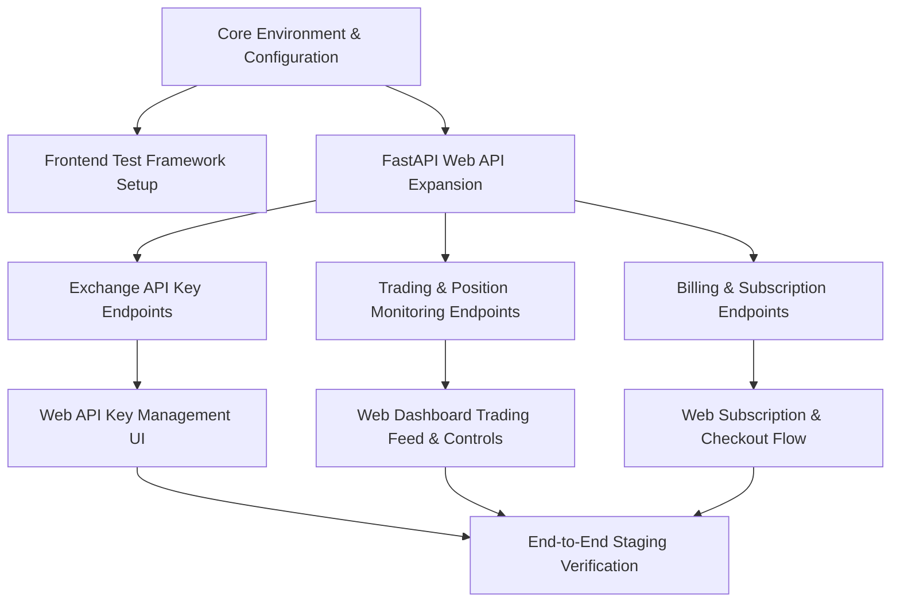

# Tadex Platform Recommended Development Priority & Next Steps

This document outlines the strict dependency-ordered implementation roadmap for future development on the Tadex platform. Tasks are prioritized based on technical dependencies rather than historical assumptions.

---

## Systemic Dependency Graph

---

## Priority Task Execution Sequence

### Phase 1: Foundation, Hardening & Config Standardization (Immediate Priority)

#### Task 1.1: Environment & Config Centralization
- **Dependency**: None (Prerequisite for all tasks).
- **Target Files**: `src/lib/config.ts`, `src/lib/api-client.ts`, `src/components/auth/ProtectedRoute.tsx`.
- **Scope**:
  - Centralize `NEXT_PUBLIC_API_BASE_URL` with explicit validation.
  - Eliminate hardcoded URL fallbacks in individual components.
  - Remove duplicate `next.config.js` file (retain `next.config.ts`).

#### Task 1.2: Web Frontend Testing Framework Setup
- **Dependency**: Task 1.1.
- **Target Files**: `package.json`, `vitest.config.ts`, `src/test/setup.ts`.
- **Scope**:
  - Install Vitest, React Testing Library, and jsdom.
  - Add test scripts (`npm run test`, `npm run test:coverage`) to `package.json`.
  - Write test suites for `auth-store.ts`, `api-client.ts`, and `ProtectedRoute.tsx`.

---

### Phase 2: Web API Endpoint Extension (FastAPI Backend)

> [!NOTE]
> All backend API work occurs inside `C:\Users\user\Documents\Tadex` (referencing and extending `app/api/`).

#### Task 2.1: Exchange API Key Management API
- **Dependency**: Phase 1.
- **Scope**:
  - Add `app/api/keys.py` exposing `POST /api/v1/keys`, `GET /api/v1/keys`, `DELETE /api/v1/keys`.
  - Wire AES-256 encryption using existing `bybit_client/supabase_client.py` helpers.

#### Task 2.2: Trading & Position Monitoring API
- **Dependency**: Phase 1.
- **Scope**:
  - Add `app/api/trading.py` exposing `GET /api/v1/positions`, `GET /api/v1/orders`, `GET /api/v1/signals/history`.
  - Connect endpoints to Supabase `positions`, `orders`, and `execution_logs` tables.

#### Task 2.3: Billing & Multi-Currency Subscription API
- **Dependency**: Phase 1.
- **Scope**:
  - Add `app/api/billing.py` exposing `GET /api/v1/billing/plans`, `POST /api/v1/billing/checkout-quote`, `GET /api/v1/billing/subscription`.
  - Reuse `BillingService` and `PlanPricingService` from `bybit-client/bybit_client/billing/`.

---

### Phase 3: Web Dashboard Expansion (Frontend Application)

#### Task 3.1: Nested Dashboard Layout & Tab Navigation
- **Dependency**: Task 1.1.
- **Target Directory**: `src/app/dashboard/`.
- **Scope**:
  - Convert `/dashboard` into nested routes: `/dashboard/overview`, `/dashboard/keys`, `/dashboard/trading`, `/dashboard/billing`, `/dashboard/settings`.
  - Implement sidebar/header navigation with active route highlights.

#### Task 3.2: API Key Management UI Component
- **Dependency**: Task 2.1, Task 3.1.
- **Target File**: `src/app/dashboard/keys/page.tsx`, `src/components/dashboard/ApiKeyManager.tsx`.
- **Scope**:
  - Build form to submit Bybit API Key + Secret with trade-only validation notice.
  - Display connected keys status, permission scope, and delete/re-key actions.

#### Task 3.3: Live Trading & Active Positions Monitor Component
- **Dependency**: Task 2.2, Task 3.1.
- **Target File**: `src/app/dashboard/trading/page.tsx`, `src/components/dashboard/PositionsTable.tsx`.
- **Scope**:
  - Display active trades, unrealized PnL, leverage, entry price, stop-loss/take-profit levels.
  - Render live signal execution log table with filtering.

#### Task 3.4: Web Subscription & Multi-Currency Checkout Component
- **Dependency**: Task 2.3, Task 3.1.
- **Target File**: `src/app/dashboard/billing/page.tsx`, `src/components/dashboard/CheckoutModal.tsx`.
- **Scope**:
  - Display provider plans with multi-currency picker (NGN, USDT, USD, EUR, GBP, KES, GHS, JPY).
  - Integrate checkout preview and Paystack/Flutterwave/Crypto payment link triggers.

---

### Phase 4: Staging Verification & Release Readiness

#### Task 4.1: Automated Test Suite Expansion
- **Dependency**: Phase 3.
- **Scope**: Write integration tests for all newly created dashboard views and API client hooks.

#### Task 4.2: Live Staging Deployment Verification
- **Dependency**: Task 4.1.
- **Scope**: Execute full manual verification checklist against `https://api.tadexapp.com` as documented in `Tadex_Frontend_Production_Checklist.md`.
